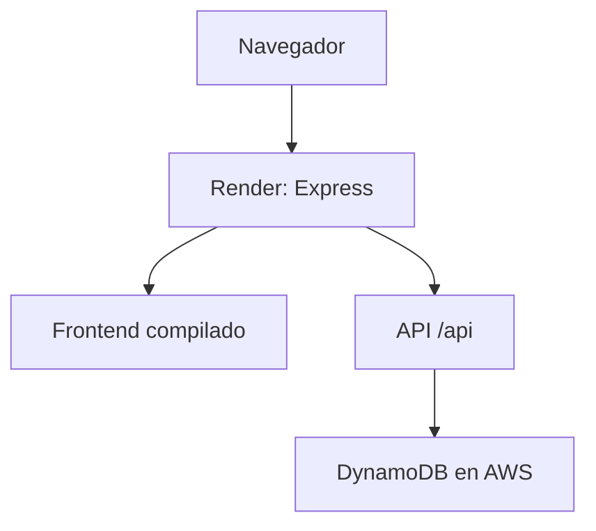

# Decisiones y guía del equipo

**Proyecto:** gestión de solicitudes de asistencia por sismos  
**Fecha:** 5 de septiembre de 2026  
**Estado:** base implementada; tabla activa e integración real con Express verificadas. Publicación en Render pendiente.

Esta guía refleja el estado actual y sustituye la propuesta inicial de carpetas. El [README](../README.md) contiene la documentación de DynamoDB, configuración y despliegue; el [contrato de API](API.md) define la integración entre front y back.

## 1. Objetivo y acuerdos confirmados

Una aplicación académica pequeña donde una persona encargada registra y hace seguimiento a solicitudes de asistencia por sismos. Debe incluir frontend, backend y DynamoDB real en AWS.

| Tema | Acuerdo |
| --- | --- |
| Backend | Node.js y Express. |
| Base de datos | Amazon DynamoDB en la cuenta AWS creada para el taller. |
| Tabla | Una tabla `SolicitudesAsistencia` con partición `solicitudId` de tipo String. |
| Atributos de partida | Los propuestos por el responsable del backend: nombre, documento, teléfono, municipio, dirección, fechas, magnitud, ayuda, estado y observaciones. |
| Entrega | Un único Web Service de Render que sirve frontend y API. |
| Evaluación | El profesor prueba la aplicación desde un enlace, sin instalar herramientas ni configurar AWS. |
| Espera inicial | Se acepta y se documenta la reactivación del servicio gratuito de Render. |
| Trabajo del grupo | El responsable inicial prepara estructura, backend y base de datos; un compañero continúa el frontend. |
| Documentación | README para DynamoDB y despliegue; esta guía para coordinación. |

## 2. Decisiones aplicadas al construir la base

Son elecciones de implementación para hacer concretos los acuerdos. El grupo puede revisarlas sin confundirlas con requisitos adicionales del profesor.

- React con Vite, JavaScript y CSS para el frontend.
- API REST bajo `/api`, respuestas JSON y validación de entrada con Zod.
- AWS SDK para JavaScript v3 con `DynamoDBDocumentClient` en el backend.
- npm workspaces para instalar desde la raíz; un `package-lock.json`, sin herramientas adicionales de gestión de monorepos.
- Sin clave de ordenamiento ni índices en esta versión. Listado con `Scan` paginado y filtro opcional por estado.
- UUID generado en el backend; `documento` y `telefono` permanecen como texto.
- `fechaSismo` guarda solo la fecha. `fechaSolicitud` y la nueva `fechaActualizacion` guardan instantes UTC y se muestran en hora de Colombia.
- Magnitud opcional: `null` cuando no se conoce. No inventar un cero para representar ausencia de información.
- Estados `PENDIENTE`, `EN_ATENCION` y `ATENDIDA`; cualquier transición está permitida.
- Un tipo de ayuda por solicitud: alimentación, alojamiento, atención médica, rescate u otra.
- La misma persona puede tener varias solicitudes: su documento no es una clave única.
- Modo explícito de memoria para desarrollar sin AWS. La API es la misma y la pantalla advierte del modo; producción lo rechaza.
- Registro, listado, consulta individual, edición y cambio de estado. Sin eliminación por ahora.

### Acceso a la publicación

La base incorpora HTTP Basic para la demostración, con `DEMO_USER` y `DEMO_PASSWORD` en Render. No hay registro de usuarios, roles ni una pantalla de login propia. En producción ambos valores son obligatorios; en desarrollo son opcionales.

**Ajuste respecto a la propuesta original:** el profesor abrirá el mismo enlace, pero el navegador le pedirá el acceso compartido. Es una decisión añadida al implementar para limitar el acceso a una API que permite modificar registros, no un requisito confirmado del enunciado. El grupo podrá revisar este mecanismo antes de publicar. Compartir el acceso por un canal privado; nunca en el código ni en el README público.

## 3. Arquitectura



Express entrega HTML, CSS y JavaScript; el navegador ejecuta la interfaz y llama a las rutas `/api` del mismo origen. Solo el backend se comunica con AWS. En desarrollo, Vite ejecuta el frontend en 5173 y reenvía `/api` a Express en 3000.

Los recursos AWS se crean aparte: desplegar en Render no crea la tabla. El equipo debe mantener tabla y servicio disponibles durante la evaluación. El SDK usa el perfil local o las credenciales del servidor; nunca las del frontend.

## 4. Estructura implementada

```text
app-gestion-asistencia-sismos/
  backend/
    scripts/               # Crear tabla y cargar ejemplos en AWS explícitamente.
    src/
      config/              # Entorno y cliente AWS.
      data/                # Ejemplos ficticios, también usados por el seed.
      middleware/          # Acceso de evaluación.
      repositories/        # DynamoDB o memoria seleccionada explícitamente.
      routes/              # Rutas HTTP y validación de entrada.
      services/            # ID, fechas y operaciones de solicitudes.
      validation/          # Campos, catálogos y cursores.
      app.js               # Express y publicación del frontend compilado.
      server.js            # Configuración e inicio del servidor.
      errors.js            # Errores HTTP controlados.
    test/                  # Contrato HTTP y operaciones del SDK simuladas.
    .env.example
    package.json
  frontend/
    src/
      components/          # Formulario y tabla.
      services/            # Cliente HTTP.
      App.jsx
      catalogos.js
      main.jsx
      styles.css
    README.md              # Guía para el compañero de frontend.
    vite.config.js
    package.json
  infra/
    dynamodb-table.json    # Definición de creación de tabla.
    iam-runtime-policy.json
  docs/
    DECISIONES.md
    API.md
  package.json
  package-lock.json
  render.yaml
  README.md
  .gitignore
```

Las rutas actúan como controladores pequeños. No se creó una capa `controllers` adicional que solo delegaría funciones. La interfaz utiliza la API incluso en demostración; no se necesita duplicar ejemplos en el frontend.

## 5. DynamoDB: alcance del diseño

La clave simple propuesta por el usuario es suficiente para identificar y actualizar solicitudes. Solo `solicitudId` se declara al crear la tabla; el resto de los atributos se escribe con cada ítem y lo valida el backend.

El listado usa `Scan` porque se espera un conjunto pequeño de datos académicos. Está paginado, no garantiza orden cronológico y los filtros no evitan leer los ítems descartados. Se conserva el cursor incluso en páginas sin coincidencias. Una consulta `Query` por estado requeriría un índice: no está implementada ni se presenta el filtro actual como una consulta indexada.

La tabla fue creada manualmente en **Ohio (`us-east-2`)** y aparece activa en la consola, con `solicitudId` (String), sin clave de ordenamiento, sin índices y con capacidad bajo demanda. Se ajustaron los valores predeterminados del backend, el ejemplo de entorno, Render y la política IAM a la tabla observada. El nombre puede cambiarse mediante `DYNAMODB_TABLE`, ajustando también IAM y Render.

Crear y actualizar usa condiciones para no sobrescribir un ID existente al crear y para no crear un ID inexistente al editar. No hay control de concurrencia con versiones; la última escritura del mismo campo prevalece.

## 6. Responsabilidades y siguientes pasos

| Responsable | Trabajo siguiente |
| --- | --- |
| Backend y base de datos | Conexión local verificada; preparar las variables secretas de Render y repetir allí el recorrido real. |
| Frontend | Continuar la interfaz a partir de los componentes existentes, revisar mensajes, distribución y experiencia del formulario. |
| Ambos | Mantener alineados nombres de campos, catálogos, estados y respuestas de API; probar el flujo integrado. |
| Todo el grupo | Completar integrantes, GitHub, criterios del profesor, acceso de evaluación y periodo de disponibilidad; publicar y verificar la URL. |

El compañero de frontend puede empezar con `npm run dev:demo`, siguiendo su README. No necesita cuenta AWS para ese trabajo. Las credenciales del backend no se comparten mediante archivos del repositorio.

## 7. Qué está listo y qué falta

Listo en el código: API, validación, repositorio DynamoDB, memoria explícita para desarrollo, interfaz inicial, scripts AWS, definición de permisos, configuración de Render y pruebas locales.

La política IAM quedó adjunta y el perfil local `asistencia-sismos` pudo ejecutar `Scan`, `PutItem`, `GetItem` y `UpdateItem` a través del script y de Express. Se cargaron dos ejemplos ficticios; una actualización temporal se leyó desde DynamoDB y el ejemplo se restauró a `PENDIENTE`.

El frontend está terminado para el alcance inicial: muestra el almacenamiento activo, lista, filtra, registra, consulta, edita y cambia estado; el formulario se presenta en un panel accesible y el listado se adapta a pantallas pequeñas.

Pendiente: crear el repositorio remoto si no existe y publicar/verificar Render. El despliegue todavía requiere configurar sus secretos y repetir el recorrido contra DynamoDB desde el servicio publicado.

Antes de entregar, ejecutar el recorrido del README en la URL real y verificar el ítem desde la consola AWS. Documentar el tiempo de reactivación de Render junto al enlace. No se incorporarán mapas, adjuntos, notificaciones ni gestión de cuentas salvo que el grupo amplíe expresamente el alcance.
